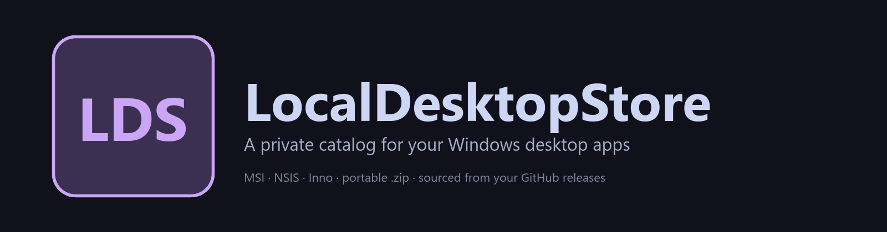
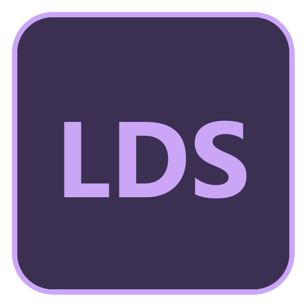

<p align="center">
  
</p>

<h1 align="center">
  
  &nbsp;LocalDesktopStore
</h1>

<p align="center">
  <a href="https://github.com/SysAdminDoc/LocalDesktopStore/releases"></a>
  <a href="LICENSE"></a>
  <a href="https://github.com/SysAdminDoc/LocalDesktopStore"></a>
  <a href="https://dotnet.microsoft.com/"></a>
</p>

> **A personal store for the Windows desktop apps you build yourself.**
> Lists every app across your GitHub repos, downloads the latest MSI / EXE / portable ZIP from the release, and runs the right installer for you. Install. Uninstall. Run. Move on.

LocalDesktopStore is the desktop sibling of [LocalChromeStore](https://github.com/SysAdminDoc/LocalChromeStore). When you ship more than a couple of WPF apps, PyInstaller bundles, and Win32 utilities under one GitHub account, hand-installing each one on a fresh box gets old fast. WinGet is close, but it requires public submission and hides anything not in the catalog. This is a private store that mirrors the LocalChromeStore UX exactly, just for desktop binaries.

---

## Why it exists

A typical sysadmin's GitHub account ships:

- **C# WPF / .NET 9** apps as MSIs or Inno Setup `.exe` installers
- **C++ Win32** apps as NSIS or Inno installers, sometimes a portable `.zip`
- **PowerShell WPF** apps as portable ZIPs
- **Python / PyQt6** apps as PyInstaller `.exe` inside a `.zip`

LocalDesktopStore knows about all of those. It picks the right asset off each release, verifies the SHA-256 sidecar, runs the correct silent-install incantation, and remembers what it installed so it can uninstall and run later.

---

## Features (v0.1.0)

- **GitHub-sourced discovery** — every repo whose latest release ships an MSI, NSIS / Inno EXE, or portable ZIP appears as a card
- **Smart asset classification** — picks the best installer per release, prefers MSI > NSIS / Inno > portable ZIP
- **Inno-vs-NSIS detection** — file-name hints first, then a bounded byte scan for the real signature ("Inno Setup Setup Data" / "Nullsoft Install System") — refuses to silently use the wrong silent-flag set
- **One-click install** — runs `msiexec /i ... /qb`, Inno `/SILENT /NORESTART`, NSIS `/S`, or extract-and-shortcut for portable ZIPs
- **One-click uninstall** — uses the recorded `UninstallString` / `QuietUninstallString` for installer-driven apps; for portable apps removes the extraction folder + Start Menu shortcut
- **Run button** — launches the registered `.exe` (from `DisplayIcon` or `InstallLocation`) for installer-driven apps, the largest extracted `.exe` for portable apps
- **Install-state detection** — pre/post snapshot of `HKLM`, `HKLM\WOW6432Node`, and `HKCU` uninstall keys, then diffs to find the new entry — far more reliable than name-matching
- **SHA-256 sidecar verification** — refuses to install if `<asset>.sha256.txt` is present and doesn't match (matches the LocalChromeStore release convention)
- **Search and filter** — by name, repo, or description; toggle to show only installed
- **Topic filter (optional)** — restrict discovery to repos tagged with a topic (default `windows-app`)
- **Optional GitHub PAT** — public limit is 60 req/h; with a PAT it's 5,000/h and unlocks private repos
- **Catppuccin Mocha dark theme** — matches LocalChromeStore exactly
- **Activity log + crash log** — every install / uninstall / run / error is logged in-app and to disk
- **Async** — every API call, download, and installer invocation runs off the UI thread

---

## Install

### From release (recommended)

1. Grab the latest `LocalDesktopStore-vX.Y.Z-win-x64.zip` from the [Releases page](https://github.com/SysAdminDoc/LocalDesktopStore/releases)
2. Verify the SHA-256: `(Get-FileHash LocalDesktopStore-vX.Y.Z-win-x64.zip).Hash` should match the `.sha256.txt` sidecar
3. Extract anywhere
4. Run `LocalDesktopStore.exe`

Requires the [.NET 9 Desktop Runtime](https://dotnet.microsoft.com/download/dotnet/9.0) — download the `Windows x64` Desktop Runtime installer if it's not already on the box.

### From source

```bash
git clone https://github.com/SysAdminDoc/LocalDesktopStore.git
cd LocalDesktopStore
dotnet build src/LocalDesktopStore/LocalDesktopStore.csproj -c Release
./src/LocalDesktopStore/bin/Release/net9.0-windows/LocalDesktopStore.exe
```

---

## Usage

1. **Click Settings** in the top right
2. Set **GitHub user / org** to your handle (defaults to `SysAdminDoc`)
3. *(Optional)* Paste a GitHub personal access token to raise rate limits and surface private repos
4. *(Optional)* Enable **Filter by topic** if you want to limit to repos tagged with `windows-app`
5. Leave **Verify SHA-256 sidecar** on if your releases ship `.sha256.txt` sidecars (LocalChromeStore / LocalDesktopStore convention)
6. Click **Save and refresh**

Every qualifying repo appears as a card. Click **Install** on a card — LocalDesktopStore downloads the asset to `%LOCALAPPDATA%\LocalDesktopStore\downloads\`, verifies the hash, runs the correct installer, and remembers what it installed. Click **Run** to launch. Click **Uninstall** to remove.

---

## Asset classification

LocalDesktopStore decides what an asset is by both filename and content:

| Asset | Routing | Silent flags |
| --- | --- | --- |
| `*.msi` | MSI | `msiexec /i <file> /qb /norestart` (logged to `%LOCALAPPDATA%\LocalDesktopStore\logs\`) |
| `*.exe` containing `Inno Setup Setup Data` (or filename has `innosetup`) | Inno Setup | `<file> /SILENT /NORESTART` |
| `*.exe` containing `Nullsoft Install System` / `Nullsoft.NSIS` (or filename has `nsis`) | NSIS | `<file> /S` |
| `*.exe` with `setup` / `installer` in the filename and no signature match | Generic installer | runs interactive — let the user click through |
| `*.zip` | Portable | extracts to `%LOCALAPPDATA%\LocalDesktopStore\apps\<owner>\<repo>\<version>\`, picks the largest non-uninstaller `.exe`, creates a Start Menu shortcut |

If multiple eligible assets ship in the same release, MSI wins, then Inno, then NSIS, then portable ZIP.

---

## Where things live

| Path | Purpose |
| --- | --- |
| `%APPDATA%\LocalDesktopStore\settings.json` | User settings (GitHub user, token, install root) |
| `%APPDATA%\LocalDesktopStore\installed.json` | Installed-app manifest (registry key, command, location) |
| `%LOCALAPPDATA%\LocalDesktopStore\apps\<owner>\<repo>\<version>\` | Extracted portable apps |
| `%LOCALAPPDATA%\LocalDesktopStore\downloads\` | Cached release assets (cleaned on demand) |
| `%LOCALAPPDATA%\LocalDesktopStore\cache\icons\` | Cached repo logos |
| `%LOCALAPPDATA%\LocalDesktopStore\logs\` | MSI install logs + crash logs |
| `%APPDATA%\Microsoft\Windows\Start Menu\Programs\LocalDesktopStore\` | Start Menu shortcuts for portable apps |

To start fresh, delete the two `LocalDesktopStore` folders in `%APPDATA%` and `%LOCALAPPDATA%`. Apps installed via MSI / Inno / NSIS stay installed — uninstall those through the normal Windows uninstaller (or click **Uninstall** on the card while the app's manifest still tracks them).

---

## Architecture

WPF on .NET 9 — MVVM, no third-party MVVM toolkit. The whole app is ~1,800 lines of C# + ~700 lines of XAML.

- `Models/` — plain data records (`AppInfo`, `InstalledApp`, `AppSettings`, `ArtifactKind`)
- `Services/`
  - `GitHubService` — Octokit-backed discovery and asset download
  - `AssetClassifier` — classify by name, refine by PE / file content
  - `InstallService` — routes to MSI / Inno / NSIS / Generic / Portable handlers
  - `UninstallRegistry` — reads `HKLM`, `HKLM\WOW6432Node`, `HKCU` uninstall keys
  - `HashVerifier` — `<asset>.sha256.txt` sidecar verification
  - `ShortcutService` — creates Start Menu `.lnk` files via `IShellLink` COM
  - `SettingsService` — JSON persistence
- `ViewModels/` — `MainViewModel` orchestrates everything; `AppCardViewModel` per-card state
- `Views/` — `AppCardView` user control + the main window
- `Themes/` — Catppuccin Mocha resource dictionary

Install-state detection runs as a registry diff: snapshot uninstall keys before invoking the installer, snapshot again afterward, take the new entry. That's far more reliable than trying to guess the installer's `DisplayName` from the repo name. We never write to the registry — the installer does.

---

## Roadmap

See [ROADMAP.md](ROADMAP.md). Highlights:

- **v0.2.0** — Auto-update on refresh: compare local installed version against latest release tag and surface "Update available" + an "Update all" button. WinGet manifest export. MSIX packaging support.
- **v0.3.0** — Catppuccin Latte light theme + accent color picker.
- **v0.4.0** — Cross-platform port via Avalonia (Linux / macOS package equivalents — `.deb`, `.dmg`).

---

## Contributing

Built primarily for personal dev/test workflow, but PRs are welcome. Open an issue first if it's a bigger change.

---

## License

[MIT](LICENSE).
