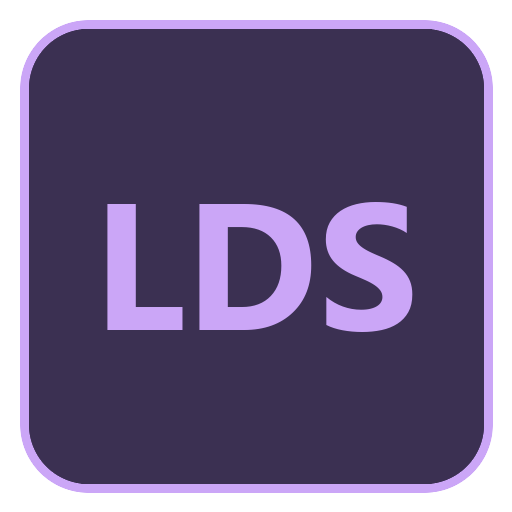

<p align="center">
  
</p>

<h1 align="center">
  
  &nbsp;LocalDesktopStore
</h1>

<p align="center">
  <a href="https://github.com/SysAdminDoc/LocalDesktopStore/releases"></a>
  <a href="LICENSE"></a>
  <a href="https://github.com/SysAdminDoc/LocalDesktopStore"></a>
  <a href="https://dotnet.microsoft.com/"></a>
</p>

> **A personal store for the Windows desktop apps you build yourself.**
> Lists every app across your GitHub repos, downloads the latest MSI / EXE / portable ZIP / MSIX release, and runs the right installer for you. Install. Uninstall. Run. Move on.

LocalDesktopStore is the desktop sibling of [LocalChromeStore](https://github.com/SysAdminDoc/LocalChromeStore). When you ship more than a couple of WPF apps, PyInstaller bundles, and Win32 utilities under one GitHub account, hand-installing each one on a fresh box gets old fast. WinGet is close, but it requires public submission and hides anything not in the catalog. This is a private store that mirrors the LocalChromeStore UX exactly, just for desktop binaries.

---

## Why it exists

A typical sysadmin's GitHub account ships:

- **C# WPF / .NET 9** apps as MSIs or Inno Setup `.exe` installers
- **Packaged Windows apps** as `.msix`, `.msixbundle`, or `.appinstaller` releases
- **C++ Win32** apps as NSIS or Inno installers, sometimes a portable `.zip`
- **PowerShell WPF** apps as portable ZIPs
- **Python / PyQt6** apps as PyInstaller `.exe` inside a `.zip`

LocalDesktopStore knows about all of those. It picks the right asset off each release, verifies the SHA-256 sidecar, runs the correct silent-install incantation, and remembers what it installed so it can uninstall and run later.

---

## Features (v0.2.1)

- **GitHub-sourced discovery** — every repo whose latest release ships an MSI, NSIS / Inno EXE, portable ZIP, MSIX, or App Installer manifest appears as a card
- **Opt-in GitHub Search discovery** — search for repos tagged `windows-app`, probe the star-sorted results for release assets, and keep them visibly separate from curated owners
- **Smart asset classification** — picks the best installer per release, preferring MSI > App Installer > MSIX / MSIXBundle > NSIS / Inno > portable ZIP
- **In-process artifact handlers** — discovery and lifecycle operations share one bundled `IArtifactHandler` registry; no remote assemblies, scripts, or dynamic plugin loads are permitted
- **Inno-vs-NSIS detection** — file-name hints first, then a bounded byte scan for the real signature ("Inno Setup Setup Data" / "Nullsoft Install System") — refuses to silently use the wrong silent-flag set
- **One-click install** — runs `msiexec /i ... /qb`, Inno `/SILENT /NORESTART`, NSIS `/S`, `Add-AppxPackage` for MSIX / MSIXBundle, or extract-and-shortcut for portable ZIPs
- **App Installer handoff** — `.appinstaller` release URLs open Windows App Installer, which owns package dependencies and update policy; the app never evaluates the URL as a shell command
- **One-click uninstall** — uses the recorded `UninstallString` / `QuietUninstallString` for installer-driven apps, `Remove-AppxPackage` for MSIX, and removes the extraction folder + Start Menu shortcut for portable apps
- **Per-card post-install actions** — optionally launch an app after install/update or ask Windows to pin its resolved launch target to the taskbar; preferences persist by `owner/repo`
- **Custom installer arguments** — per-card MSI / Inno / NSIS / EXE switches are validated with Windows quoting rules, passed as argument tokens without shell evaluation, and stored in `installed.json` for later updates
- **Run button** — launches the registered `.exe` (from `DisplayIcon` or `InstallLocation`) for installer-driven apps, the largest extracted `.exe` for portable apps
- **Install-state detection** — pre/post snapshot of `HKLM`, `HKLM\WOW6432Node`, and `HKCU` uninstall keys, then diffs to find the new entry — far more reliable than name-matching
- **WinGet detection oracle** — refreshes can query WinGet's installed-package catalog through its COM API and cross-check recorded uninstall metadata; if the WinGet server is unavailable, the registry diff remains authoritative
- **SHA-256 sidecar verification** — refuses to install if `<asset>.sha256.txt` is present and doesn't match (matches the LocalChromeStore release convention)
- **Verified download cache** — sidecar-verified assets are cached under `downloads\cache\<owner>\<repo>\<version>\<sha256>\`; matching updates restore locally after re-checking the blob hash
- **Authenticode publisher verification** — MSI/EXE installers must be trusted by Windows before they run; the signer thumbprint is pinned per installed repo and publisher changes require explicit approval. MSIX certificates are validated by Windows Appx deployment, and LDS never imports them
- **Opt-in OSV advisory checks** — refresh can query OSV.dev for open advisories per GitHub release repository and show the informational count on each card; checks are off by default and never block discovery or installation
- **Search and filter** — by name, repo, or description; toggle to show only installed
- **Topic filter (optional)** — restrict discovery to repos tagged with a topic (default `windows-app`)
- **Multi-owner settings editor** — add/remove extra GitHub users or organizations without editing JSON
- **Hidden repo filtering** — hide a card directly from the catalog or manage hidden `owner/repo` entries in settings
- **Optional GitHub PAT** — public limit is 60 req/h; with a PAT it's 5,000/h and unlocks private repos
- **Search publisher pins** — GitHub Search results require an explicit `owner/repo=SHA-1 thumbprint` pin and a matching trusted Authenticode MSI/EXE signer before installation; archive and package handoffs remain curated-only
- **WinGet manifest export** — export a v1.6 singleton manifest per card, with a locally calculated installer hash and the appropriate MSI / Inno / NSIS / EXE / portable ZIP metadata
- **Catppuccin Mocha / Latte themes** — switch palettes at runtime, with an optional Windows system accent
- **Runtime localization** — English is the default, with System default and Español choices in Settings; translations live in `Localization/Strings*.resx` and update the WPF surface immediately
- **Enterprise MSI packaging** — the WiX lane emits separately validated unsigned x64 per-user and per-machine MSIs for GPO / Intune deployment, with an optional machine-scope DPAPI settings seed
- **Velopack self-update** — Velopack-packaged installs can check the public GitHub release channel, download the verified update package, and restart into the new version; ordinary ZIP installs keep the manual update path
- **Scheduled background update checks** — optionally poll every 1–24 hours, keep a least-privilege interactive Task Scheduler entry, and show native tray notifications without installing automatically
- **Bulk selection operations** — select cards and run install, update, or uninstall sequentially with one aggregate status banner
- **Catalog transfer** — File → Export/Import round-trips owners, hidden per-app overrides, install preferences, and version pins in a `.lds.json` file without exporting the GitHub PAT
- **Headless CLI** — `LocalDesktopStore.exe --install owner/repo`, `--uninstall`, `--run`, `--refresh`, and `--list` share the same service layer as the UI; `--json` emits one machine-readable result
- **Activity log + crash log** — every install / uninstall / run / error is logged in-app and to disk
- **Async** — every API call, download, and installer invocation runs off the UI thread

---

## Install

### From release (recommended)

1. Grab the latest `LocalDesktopStore-vX.Y.Z-win-x64.zip` from the [Releases page](https://github.com/SysAdminDoc/LocalDesktopStore/releases)
2. Verify the SHA-256: `(Get-FileHash LocalDesktopStore-vX.Y.Z-win-x64.zip).Hash` should match the `.sha256.txt` sidecar
3. Extract anywhere
4. Run `LocalDesktopStore.exe`

Requires the [.NET 9 Desktop Runtime](https://dotnet.microsoft.com/download/dotnet/9.0) — download the `Windows x64` Desktop Runtime installer if it's not already on the box.

### Enterprise MSI deployment

Build the two unsigned x64 packages locally after publishing the framework-dependent app:

```powershell
pwsh -NoProfile -File installer\build.ps1 -Version 0.2.1
```

The per-user MSI installs to `%LOCALAPPDATA%\Programs\LocalDesktopStore` without elevation. The per-machine MSI installs to `%ProgramFiles%\LocalDesktopStore` and is suitable for an elevated GPO deployment or an Intune Win32 app. Both packages are intentionally unsigned; the project never adds a code-signing step or certificate trust.

For a silent deployment, use the package that matches the assignment scope:

```powershell
msiexec.exe /i LocalDesktopStore-v0.2.1-per-user-x64.msi /qn /norestart
msiexec.exe /i LocalDesktopStore-v0.2.1-per-machine-x64.msi /qn /norestart
```

To seed a shared GitHub owner and PAT without putting the token in a command line or plaintext JSON, provide it to the provisioning process through the `LDS_GITHUB_TOKEN` environment variable and write the machine-scope DPAPI seed under `%ProgramData%`:

```powershell
pwsh -NoProfile -File installer\New-EnterpriseSettings.ps1 `
  -OutputPath "$env:ProgramData\LocalDesktopStore\settings.json" `
  -GitHubUser SysAdminDoc
```

LDS reads that seed only when the signed-in user has no `%APPDATA%\LocalDesktopStore\settings.json`. The `GitHubTokenProtected` value is encrypted with Windows DPAPI machine scope; changing settings preserves the protected form until an operator explicitly replaces the token.

### From source

```bash
git clone https://github.com/SysAdminDoc/LocalDesktopStore.git
cd LocalDesktopStore
dotnet build src/LocalDesktopStore/LocalDesktopStore.csproj -c Release
./src/LocalDesktopStore/bin/Release/net9.0-windows10.0.26100.0/LocalDesktopStore.exe
```

---

## Usage

1. **Click Settings** in the top right
2. Set **GitHub user / org** to your handle (defaults to `SysAdminDoc`)
3. *(Optional)* Paste a GitHub personal access token to raise rate limits and surface private repos
4. *(Optional)* Add extra GitHub users or organizations under **Extra GitHub owners**
5. *(Optional)* Add hidden repos as `owner/repo`, or hide a card from the catalog after refresh
6. *(Optional)* Enable **Filter by topic** if you want to limit to repos tagged with `windows-app`
7. *(Optional)* Enable **GitHub Search discovery**, choose its topic (default `windows-app`), and add one signer thumbprint per search-discovered `owner/repo` as `owner/repo=THUMBPRINT`
8. *(Optional)* Switch to the **Catppuccin Latte light theme** or enable the **Windows system accent** under Appearance; both apply immediately and persist when you save settings
9. *(Optional)* Choose **System default**, **English**, or **Español** under Appearance; the selected culture applies immediately and persists when you save settings
10. *(Optional)* Enable **Check for updates in the background** and choose an interval from 1–24 hours; checks run as your signed-in user, notify through the tray, and never install automatically
11. Leave **Verify SHA-256 sidecar** on if your releases ship `.sha256.txt` sidecars (LocalChromeStore / LocalDesktopStore convention)
12. *(Optional)* Enable **Check open-source advisories** to query OSV.dev during refresh; results are informational and never block installs
13. Keep your MSI/EXE release assets Authenticode-signed and your MSIX publisher certificate trusted by Windows; LocalDesktopStore refuses unsigned or untrusted packages and never imports certificates automatically
14. Click **Save and refresh**

Use **File → Check for LocalDesktopStore updates** when running the Velopack `Setup.exe` install. The command downloads and applies a newer published Velopack package, then restarts the app. A regular ZIP or WiX MSI install reports that the Velopack self-update channel is unavailable and remains on the normal manual/Windows Installer update path.

Select one or more card checkboxes to reveal **Install selected**, **Update selected**, and **Uninstall selected**. Bulk work is deliberately sequential so installer output and failures remain attributable to one app at a time.

Use **File → Export catalog** to create a portable `.lds.json` loadout, then **File → Import catalog** on another machine. Imported version pins are stored as catalog metadata; the destination's real install manifest remains authoritative and no app is installed by import.

Every qualifying repo appears as a card. Click **Install** on a card — LocalDesktopStore restores a verified sidecar-matching asset from `%LOCALAPPDATA%\LocalDesktopStore\downloads\cache\` when available, otherwise downloads it, verifies the hash, runs the correct installer, and remembers what it installed. `.appinstaller` cards hand the HTTPS release URL to Windows App Installer and ask you to refresh after its flow completes. Click **Run** to launch. Click **Uninstall** to remove.

Use the per-card **Run after install** and **Pin after install** checkboxes when you want an install or update to finish with a launch or taskbar action. The pin option uses the Windows shell `pintotaskbar` verb and reports a clear activity-log message when Windows does not expose a pin-capable launch target; it never injects input or silently changes an unrelated shortcut.

For installer-driven cards, enter optional **Custom installer arguments** such as `INSTALLDIR="C:\Program Files\Example"` or `/D="C:\Tools"`. LocalDesktopStore keeps the known safe defaults, appends the parsed override tokens, and carries the saved value into later updates; portable ZIP, MSIX, and App Installer cards leave this field disabled.

PowerShell and device-prep scripts can use the headless path without opening the WPF window:

```powershell
.\LocalDesktopStore.exe --install SysAdminDoc/ExampleApp --json
.\LocalDesktopStore.exe --list
.\LocalDesktopStore.exe --uninstall SysAdminDoc/ExampleApp
```

CLI exit codes are `0` for success, `2` for invalid arguments, `3` when the requested app is not discovered or tracked, `4` for an operation failure, and `5` for cancellation. Publisher changes remain fail-closed because the CLI has no interactive approval prompt.

Use **Export** on a card to write a WinGet v1.6 singleton manifest to `Desktop\manifests\<first-letter>\<owner>\<repo>\<version>\<owner>.<repo>.yaml`. The exporter hashes the downloaded release asset locally; review the generated MIT/license and installer metadata before submitting it with `wingetcreate`.

---

## Asset classification

LocalDesktopStore decides what an asset is by both filename and content:

| Asset | Routing | Silent flags |
| --- | --- | --- |
| `*.msi` | MSI | `msiexec /i <file> /qb /norestart` (logged to `%LOCALAPPDATA%\LocalDesktopStore\logs\`) |
| `*.appinstaller` | Windows App Installer | opens `ms-appinstaller:?source=<url>`; App Installer owns dependencies and update policy |
| `*.msix` / `*.msixbundle` | MSIX package | `Add-AppxPackage -Path <file>` for the current user; Windows validates the package certificate |
| `*.exe` containing `Inno Setup Setup Data` (or filename has `innosetup`) | Inno Setup | `<file> /SILENT /NORESTART` |
| `*.exe` containing `Nullsoft Install System` / `Nullsoft.NSIS` (or filename has `nsis`) | NSIS | `<file> /S` |
| `*.exe` with `setup` / `installer` in the filename and no signature match | Generic installer | runs interactive — let the user click through |
| `*.zip` | Portable | extracts to `%LOCALAPPDATA%\LocalDesktopStore\apps\<owner>\<repo>\<version>\`, picks the largest non-uninstaller `.exe`, creates a Start Menu shortcut |

Before an MSI or EXE installer is invoked, Windows `WinVerifyTrust` must accept its Authenticode signature. The certificate thumbprint and subject are recorded in `installed.json`; a later release signed by a different publisher requires an explicit approval prompt. MSIX packages are passed to the current user's `Add-AppxPackage` cmdlet without `-AllowUnsigned`; if Windows does not trust the package certificate, the error explains that the publisher must be trusted through an approved Windows process. Portable ZIP archives do not have an archive-level Authenticode signature, so they use the existing sidecar hash verification instead.

If multiple eligible assets ship in the same release, MSI wins, then App Installer, MSIX / MSIXBundle, Inno, NSIS, then portable ZIP.

---

## Where things live

| Path | Purpose |
| --- | --- |
| `%APPDATA%\LocalDesktopStore\settings.json` | User settings (GitHub user, token, install root) |
| `%ProgramData%\LocalDesktopStore\settings.json` | Optional enterprise seed (owner plus DPAPI machine-protected GitHub PAT) |
| `%APPDATA%\LocalDesktopStore\installed.json` | Installed-app manifest (registry key, command, location) |
| `%LOCALAPPDATA%\LocalDesktopStore\apps\<owner>\<repo>\<version>\` | Extracted portable apps |
| `%LOCALAPPDATA%\LocalDesktopStore\downloads\` | Cached release assets (cleaned on demand) |
| `%LOCALAPPDATA%\LocalDesktopStore\downloads\cache\<owner>\<repo>\<version>\<sha256>\` | Verified whole-asset download cache |
| `%LOCALAPPDATA%\LocalDesktopStore\cache\icons\` | Cached repo logos |
| `%LOCALAPPDATA%\LocalDesktopStore\logs\` | MSI install logs + crash logs |
| `%APPDATA%\Microsoft\Windows\Start Menu\Programs\LocalDesktopStore\` | Start Menu shortcuts for portable apps |

To start fresh, delete the two `LocalDesktopStore` folders in `%APPDATA%` and `%LOCALAPPDATA%`. Apps installed via MSI / Inno / NSIS stay installed — uninstall those through the normal Windows uninstaller (or click **Uninstall** on the card while the app's manifest still tracks them).

---

## Architecture

WPF on .NET 9 — MVVM, no third-party MVVM toolkit. The whole app is ~1,800 lines of C# + ~700 lines of XAML.

- `Models/` — plain data records (`AppInfo`, `InstalledApp`, `AppSettings`, `ArtifactKind`)
- `Services/`
  - `GitHubService` — Octokit-backed discovery and asset download
  - `PublisherPinParser` — validates explicit search-discovery owner/repo-to-Authenticode-thumbprint pins
  - `ArtifactHandlerRegistry` / `IArtifactHandler` — bundled in-process handlers for MSI / Inno / NSIS / Generic / MSIX / App Installer / Portable assets, with guarded Velopack and Linux AppImage entries
  - `AssetClassifier` — delegates name classification to the handler registry, then refines generic EXEs by PE / file content
  - `InstallService` — host/orchestrator that invokes the selected handler for install / uninstall / run
  - `CommandLineParser` / `CommandLineHost` — headless install, uninstall, run, refresh, list, version, and JSON output without constructing the main window
  - `AppxPackageService` — standard-user MSIX install/uninstall, manifest identity lookup, certificate-trust errors, and App Installer URI handoff
  - `WingetDetectionService` — best-effort WinGet installed-catalog query and uninstall-metadata cross-check; unavailable COM falls back cleanly
  - `TaskbarPinService` — pointer-free shell context-verb pinning for the optional per-card taskbar action
  - `InstallerArgumentParser` — Windows-compatible quoting validation and tokenization for custom installer switches
  - `DownloadCacheService` — sidecar-keyed verified whole-asset cache with corrupt-entry fallback
  - `UninstallRegistry` — reads `HKLM`, `HKLM\WOW6432Node`, `HKCU` uninstall keys
  - `HashVerifier` — `<asset>.sha256.txt` sidecar verification
  - `OsvService` — opt-in, bounded OSV.dev advisory queries for GitHub release repositories
  - `VelopackUpdateService` — explicit GitHub release-channel check/download/restart for Velopack-installed copies
  - `ShortcutService` — creates Start Menu `.lnk` files via `IShellLink` COM
  - `SettingsService` — JSON persistence
  - `ScheduledUpdateService` / `ScheduledTaskRegistrar` — opt-in polling, least-privilege Task Scheduler registration, and headless checks
  - `TrayIconService` — native `Shell_NotifyIcon` update notifications
  - `CatalogTransferService` — validated, token-free `.lds.json` import/export
- `Localization/` — neutral English `Strings.resx`, community `Strings.{lang}.resx` resources, and the live WPF `LocExtension` provider
- `installer/` — WiX 5 source and a repeatable build/ICE-validation script for separate per-user and per-machine unsigned MSIs, plus DPAPI seed provisioning
- `EnterpriseSettingsProtector` — Windows machine-scope DPAPI protection for enterprise GitHub PAT seeds; plaintext PATs are never emitted by the provisioning script
- `ViewModels/` — `MainViewModel` orchestrates everything; `AppCardViewModel` per-card state
- `Views/` — `AppCardView` user control + the main window
- `Themes/` — Catppuccin Mocha and Latte resource dictionaries plus the shared runtime-switchable control styles

Install-state detection runs as a registry diff: snapshot uninstall keys before invoking the installer, snapshot again afterward, take the new entry. That's far more reliable than trying to guess the installer's `DisplayName` from the repo name. On refresh, the optional WinGet oracle provides an independent installed-package view and reports uninstall-command differences without replacing the recorded registry command. We never write to the registry — the installer does.

---

## Roadmap

See [ROADMAP.md](ROADMAP.md). Highlights:

- **v0.2.1** — Multi-owner settings editor and hidden-repo filtering are live.
- **Shipped** — Authenticode publisher pinning, per-card error/crash-log links, accessibility names/live log, WinGet manifest export, and Catppuccin Latte runtime theming.
- **Shipped next** — scheduled background checks and bulk operations.
- **Shipped next** — catalog import/export and MSIX / App Installer support.
- **Shipped** — WinGet COM detection oracle with a safe registry fallback when the local WinGet server is unavailable.
- **Shipped** — per-card post-install launch and taskbar-pin preferences.
- **Shipped** — per-card custom installer arguments and sidecar-verified download caching.
- **v0.4.0** — Cross-platform port via Avalonia (Linux / macOS package equivalents — `.deb`, `.dmg`).

---

## Contributing

Built primarily for personal dev/test workflow, but PRs are welcome. Open an issue first if it's a bigger change.

---

## License

[MIT](LICENSE).
